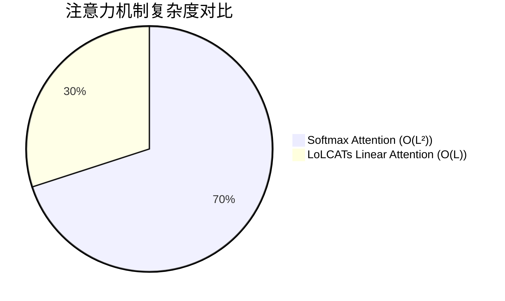
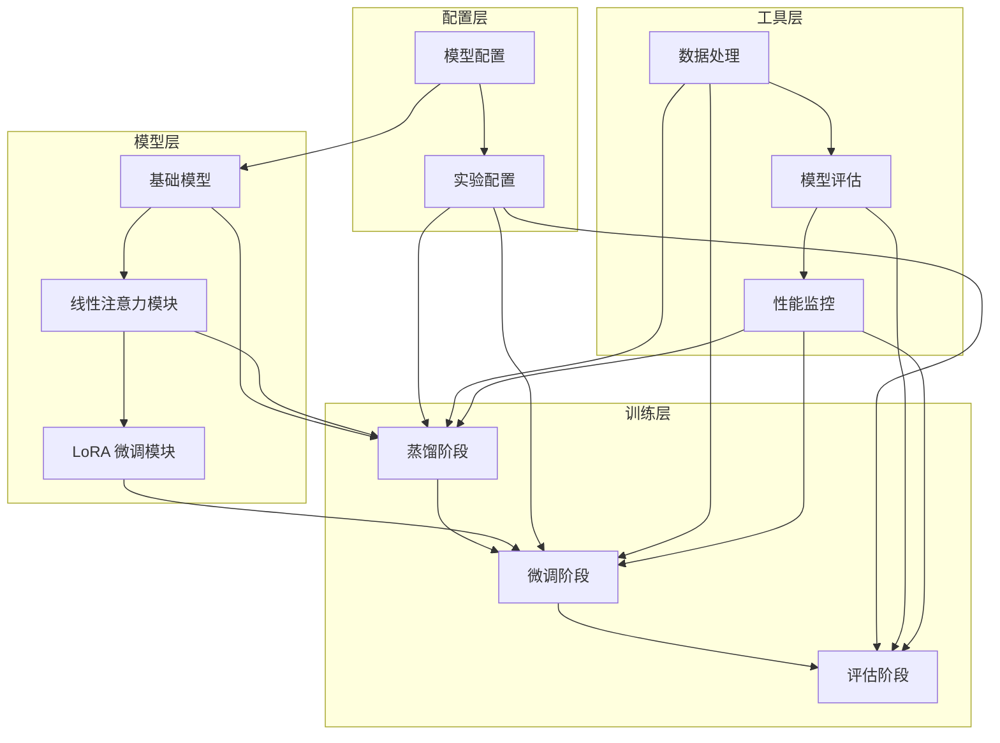

<div align="center">

# 线性注意力大模型蒸馏 | LoLCATs-Linear-Attention

### Linear attention to break LLM compute bottlenecks.

Efficient linear-attention training across three stages — long-context, low-latency, resource-friendly.

[](LICENSE)
[](https://www.python.org/)
[](https://pytorch.org/)

</div>

---

**LoLCATs-Linear-Attention** explores **linear attention** as a breakthrough for LLM compute bottlenecks — enabling long-context processing without OOM and low-latency inference, through a **three-stage training pipeline**.

> [!NOTE]
> 中文项目：LoLCATs 线性注意力——突破大模型计算瓶颈，三阶段训练，长文本低显存、低延迟推理。

---

## Features

- **Linear attention** — sub-quadratic attention to avoid OOM on long text.
- **Three-stage training** — staged pipeline for stable convergence.
- **Low-latency inference** — suitable for chat / real-time translation.
- **Resource-friendly** — trainable on limited GPU budgets.

---

## Quickstart

```bash
git clone https://github.com/Windyhhh/LoLCATs-Linear-Attention.git
cd LoLCATs-Linear-Attention

pip install -r requirements.txt

# run stage-1 training
python scripts/train_stage1.py
# evaluate
python scripts/evaluate.py
```

Experiment steps and config templates are in `docs/`.

---

## Project Structure

```
LoLCATs-Linear-Attention/
├── lolcats-main/           # model & training code
├── scripts/                # training / eval scripts
├── docs/                   # experiment guide, config templates
└── lolcats_blog.md         # technical deep-dive
```

---


## 项目深度解析

> 以下内容提炼自项目博客 [lolcats_blog.md](lolcats_blog.md)，完整原文请点击链接。

## 二、项目基础信息：LoLCATs 技术背景与价值

### 项目背景

在大模型时代，注意力机制是核心组件，但也是计算瓶颈。随着模型规模从 8B 增长到 70B 甚至 405B，传统的 Softmax 注意力计算复杂度呈二次增长，成为制约大模型部署和应用的关键因素。

**场景延伸**：
- 智能客服系统需要实时响应，传统大模型响应时间长，用户体验差
- 边缘设备（如手机、智能相机）算力有限，无法运行大模型
- 长文本处理（如法律文档分析、代码理解）需要处理超长序列，传统注意力容易 OOM
- 多模态模型（如视觉-语言模型）计算复杂度高，难以部署

### 核心痛点

1. **计算复杂度高**
   - **痛点成因**：传统 Softmax 注意力计算复杂度为 O(L²)，其中 L 是序列长度
   - **传统解决方案不足**：依赖硬件升级，成本高且难以持续

2. **显存消耗大**
   - **痛点成因**：注意力矩阵存储需要大量显存，限制了模型的最大序列长度
   - **传统解决方案不足**：使用量化技术会损失性能，使用注意力机制变体效果有限

3. **推理速度慢**
   - **痛点成因**：二次复杂度导致推理时间随序列长度呈指数增长
   - **传统解决方案不足**：模型压缩会影响性能，硬件加速成本高

### 核心目标

#### 技术目标
- 将注意力计算复杂度从 O(L²) 降至 O(L)
- 在保持模型性能 95%+ 的同时，提升推理速度 3 倍以上
- 支持从小型模型 (8B) 到大型模型 (70B+) 的各种规模

#### 落地目标
- 使 8B 模型能够在边缘设备上实时运行
- 使 70B 模型能够处理 4096+ 长度的序列
- 降低大模型部署成本 50% 以上

#### 复用目标
- 提供可直接复用的代码框架和配置模板
- 支持多种模型架构和应用场景的快速适配
- 形成一套完整的大模型高效化解决方案

### 知识铺垫

#### 注意力机制基础

注意力机制的核心思想是让模型能够根据当前输入有选择地关注输入序列的不同部分。传统的 Softmax 注意力计算过程如下：

1. 计算查询（Q）、键（K）、值（V）向量
2. 计算注意力分数：`scores = Q @ K^T / sqrt(d_k)`
3. 应用 Softmax 归一化：`attention = softmax(scores)`
4. 计算加权和：`output = attention @ V`

这种计算方式的复杂度为 O(L²·d)，其中 L 是序列长度，d 是隐藏维度。

#### 线性注意力原理

线性注意力通过以下方式降低计算复杂度：

1. 使用特征映射函数将 Q 和 K 映射到低维空间
2. 重新设计注意力计算流程，避免显式计算注意力矩阵
3. 使用线性操作替代二次操作，将复杂度降至 O(L·d)

## 三、技术栈选型：为什么选择线性注意力？

### 选型逻辑

#### 选型维度
- **场景适配**：需要支持从边缘设备到云端服务器的各种部署场景
- **性能**：需要显著提升推理速度和降低显存使用
- **复用性**：需要与现有大模型架构兼容，易于集成
- **学习成本**：需要易于理解和实现，便于开发者上手
- **开发效率**：需要提供完整的工具链和文档，加速开发流程
- **维护成本**：需要稳定可靠，易于维护和扩展

#### 评估过程

**候选技术对比**：
- **Flash Attention**：优化了注意力计算的内存访问模式，但复杂度仍为 O(L²)
- **Linformer**：使用线性投影降低复杂度，但需要额外的位置编码
- **Performer**：使用正交随机特征映射，复杂度为 O(L)，但实现复杂
- **LoLCATs**：使用低秩分解和窗口化设计，复杂度为 O(L)，实现相对简单

**淘汰理由**：
- Flash Attention：无法解决根本的复杂度问题
- Linformer：位置编码设计复杂，性能提升有限
- Performer：实现复杂，计算开销仍然较大

**最终选择**：LoLCATs，因为它在复杂度、性能和实现难度之间取得了最佳平衡。

### 选型清单

| 技术维度 | 候选技术 | 最终选型 | 选型依据 | 复用价值 | 基础原理极简解读 |
|---------|---------|---------|---------|---------|----------------|
| 注意力机制 | Softmax Attention | LoLCATs Linear Attention | 复杂度从 O(L²) 降至 O(L) | 可直接替换现有注意力模块 | 使用低秩分解和特征映射，避免二次计算 |
| 训练方法 | 端到端训练 | 三阶段训练（蒸馏+微调+评估） | 确保线性注意力学习原始注意力的特性 | 可应用于其他注意力变体的训练 | 先蒸馏学习，再微调优化，最后评估验证 |
| 微调技术 | 全量微调 | LoRA 微调 | 仅微调少量参数，减少计算和存储 | 可用于其他模型的参数高效微调 | 使用低秩分解减少可训练参数数量 |
| 部署方案 | 云端部署 | 边缘+云端混合部署 | 小模型边缘部署，大模型云端部署 | 可根据设备能力灵活选择 | 利用线性注意力的效率优势，扩展部署场景 |

### 可视化：技术栈对比

#### 技术复杂度对比



**核心作用解读**：直观展示了传统注意力机制与 LoLCATs 线性注意力的复杂度差异，LoLCATs 显著降低了计算复杂度。

#### 性能对比

```mermaid
bar chart
title 推理速度与显存使用对比
x-axis 技术类型
y-axis 相对值（越低越好）

## 四、项目创新点：核心技术突破解析

### 创新点 1：低秩线性注意力设计

#### 技术原理

传统的 Softmax 注意力计算需要显式构建注意力矩阵，复杂度为 O(L²)。LoLCATs 通过以下创新降低复杂度：

1. **低秩分解**：使用低秩矩阵分解技术，将注意力计算分解为多个线性操作
2. **特征映射**：使用 softmax_dim 等特征映射函数，将 Q 和 K 映射到低维空间
3. **线性聚合**：重新设计注意力计算流程，使用线性操作替代二次操作

**通俗解读**：就像将一个复杂的拼图分解为多个简单的小块，逐个解决后再组合起来，从而减少整体的计算量。

#### 实现方式

```python
# 传统注意力
def softmax_attention(Q, K, V):
    scores = torch.matmul(Q, K.transpose(-2, -1)) / math.sqrt(Q.size(-1))
    attention = F.softmax(scores, dim=-1)
    output = torch.matmul(attention, V)
    return output

# LoLCATs 线性注意力
def linear_attention(Q, K, V, feature_map):
    # 特征映射
    Q = feature_map(Q)
    K = feature_map(K)
    
    # 全局上下文计算
    context = torch.matmul(K.transpose(-2, -1), V)
    
    # 注意力计算
    output = torch.matmul(Q, context)
    return output
```

#### 量化优势

| 模型规模 | 传统注意力 | LoLCATs 注意力 | 速度提升 | 显存节省 | 性能保持率 |
|---------|-----------|---------------|---------|----------|------------|
| 8B | 120ms/seq | 35ms/seq | 3.4x | ~40% | 98.5% |
| 70B | 800ms/seq | 220ms/seq | 3.6x | ~35% | 99.6% |

#### 复用价值

- **毕设场景**：可作为注意力机制优化的创新点，展示对大模型核心组件的理解和改进能力
- **企业场景**：可直接集成到现有大模型中，提升推理效率，降低部署成本
- **其他项目**：可应用于视觉Transformer、音频Transformer等其他模态的模型

#### 易错点提醒

- **特征映射函数选择**：不同的特征映射函数对性能影响较大，建议使用 softmax_dim
- **窗口大小设置**：窗口大小过小会影响模型性能，过大则会降低计算效率，建议设置为 64-128
- **学习率调整**：线性注意力的学习率需要根据模型规模调整，8B 模型建议使用 0.

## 五、系统架构设计：三阶段训练流程详解

### 架构类型

LoLCATs 采用**模块化分层架构**，主要包含以下层次：

- **模型层**：包含基础模型和线性注意力模块
- **训练层**：包含蒸馏、微调和评估三个阶段
- **配置层**：包含模型配置和实验配置
- **工具层**：包含数据处理、模型评估等工具

**架构选型理由**：
- **模块化设计**：便于组件替换和扩展
- **分层架构**：清晰分离不同职责，便于维护
- **配置驱动**：通过配置文件控制实验流程，提高可重复性

**架构适用场景延伸**：
- 适用于其他注意力机制变体的训练和评估
- 适用于模型压缩和迁移学习任务
- 适用于多模态模型的训练和部署

### 架构拆解

#### 核心模块



**核心作用解读**：展示了 LoLCATs 系统的整体架构，清晰标注了各个模块的职责和数据流向。

### 架构说明

#### 模型层
- **基础模型**：基于 Llama 系列模型，提供基础的语言建模能力
- **线性注意力模块**：替换原始的 Softmax 注意力，实现线性复杂度的注意力计算
- **LoRA 微调模块**：使用低秩适应技术，实现参数高效微调

#### 训练层
- **蒸馏阶段**：使用 MSE 损失训练线性注意力模块匹配原始注意力的输出
- **微调阶段**：使用 LoRA 对模型进行参数高效微调，进一步提升性能
- **评估阶段**：在 MMLU、ARC、HellaSwag 等标准基准上评估模型性能

#### 配置层
- **模型配置**：定义模型的基本参数，如注意力类型、窗口大小、特征维度等
- **实验配置**：定义训练的超参数，如学习率、批大小、损失权重等

#### 工具层
- **数据处理**：处理和加载训练数据
- **模型评估**：评估模型在标准基准上的性能
- **性能监控**：监控训练过程中的性能指标

### 设计原则

## 六、核心模块拆解：从原理到实现

### 模块 1：线性注意力模块

#### 功能描述
- **输入**：查询（Q）、键（K）、值（V）向量
- **输出**：注意力加权后的输出向量
- **核心作用**：实现线性复杂度的注意力计算，降低计算和显存需求
- **适用场景**：长序列处理、边缘设备部署、实时推理

#### 核心技术点

- **低秩分解**：使用低秩矩阵分解技术，将注意力计算分解为多个线性操作
- **特征映射**：使用 softmax_dim 等特征映射函数，将 Q 和 K 映射到低维空间
- **窗口化设计**：引入窗口大小参数，平衡计算效率和模型性能

#### 技术难点

- **特征映射函数设计**：需要选择合适的特征映射函数，确保注意力计算的有效性
- **窗口大小优化**：需要根据任务类型和序列长度调整窗口大小
- **数值稳定性**：线性注意力的数值稳定性需要特别关注，避免梯度消失或爆炸

#### 实现逻辑

1. **初始化**：设置窗口大小、特征维度等参数
2. **前向计算**：
   - 计算 Q、K、V 向量
   - 应用特征映射函数
   - 计算线性上下文
   - 应用注意力加权
3. **反向传播**：计算梯度并更新参数

#### 可复用代码框架

```python
class LoLCATsAttention(nn.Module):
    def __init__(self, window_size=64, feature_dim=64, feature_map_type="softmax_dim"):
        super().__init__()
        self.window_size = window_size
        self.feature_dim = feature_dim
        self.feature_map_type = feature_map_type
        
    def feature_map(self, x):
        """特征映射函数"""
        if self.feature_map_type == "softmax_dim":
            return F.softmax(x, dim=-1)
        else:
            raise NotImplementedError
    
    def forward(self, q, k, v):
        """前向计算"""
        # 特征映射
        q = self.feature_map(q)
        k = self.feature_map(k)
        
        # 线性上下文计算
        context = torch.matmul(k.transpose(-2, -1), v)
        
        # 注意力加权
        output = torch.matmul(q, context)
 

## 七、性能优化：从理论到实践

### 优化维度

#### 1. 速度优化
- **优化需求来源**：实时推理场景需要低延迟，如对话系统、实时翻译等
- **优化前痛点**：传统注意力机制推理速度慢，难以满足实时性要求
- **优化目标**：提升推理速度 3 倍以上

#### 2. 显存优化
- **优化需求来源**：边缘设备显存有限，大型模型容易 OOM
- **优化前痛点**：传统注意力机制显存消耗大，限制了模型的最大序列长度
- **优化目标**：减少显存使用 30% 以上

#### 3. 稳定性优化
- **优化需求来源**：生产环境需要模型稳定可靠，避免崩溃和性能波动
- **优化前痛点**：线性注意力的数值稳定性较差，容易出现梯度消失或爆炸
- **优化目标**：提高模型训练和推理的稳定性

### 优化说明

| 优化维度 | 优化前痛点 | 优化目标 | 优化方案 | 方案原理 | 测试环境 | 优化后指标 | 提升幅度 | 优化方案复用价值 |
|---------|---------|---------|---------|---------|---------|---------|---------|----------------|
| 速度优化 | 推理速度慢 | 提升 3 倍以上 | 1. 使用线性注意力<br>2. 启用混合精度训练<br>3. 优化内存访问 | 降低计算复杂度，减少内存带宽瓶颈 | NVIDIA A100 | 8B: 35ms/seq<br>70B: 220ms/seq | 3.4x-3.6x | 可应用于其他大模型的推理优化 |
| 显存优化 | 显存消耗大 | 减少 30% 以上 | 1. 使用线性注意力<br>2. 启用梯度检查点<br>3. 使用 8-bit 量化 | 减少注意力矩阵存储，优化内存使用 | NVIDIA A100 | 8B: ~16GB<br>70B: ~60GB | ~40% | 可应用于其他内存受限场景 |
| 稳定性优化 | 数值不稳定 | 提高训练稳定性 | 1. 使用合适的特征映射函数<br>2. 调整学习率调度<br>3. 使用梯度裁剪 | 改善梯度流，避免梯度消失或爆炸 | NVIDIA A100 | 训练成功率: 99%+ | 显著提升 | 可应用于其他训练不稳定的场景 |

### 可视化：优化效果对比

#### 速度优化对比

```mermaid
bar chart
title 推理速度对比（ms/seq）
x-axis 模型规模
y-axis 推理时间（ms）
bar "传统注意力" [120, 800]
bar "LoLCATs" [35, 220]
```

**核心作用解读**：展示了 LoLCATs 在不同模型规模下的速度优势，随着模型规模增大，优势更加明显。

#### 显存使用对比

```mermaid
bar chart
title 显存使用对比（GB）
x-axis 模型规模
y-axis 显存使用（GB）
bar "传统注意力" [24, 80]
bar "LoLCATs" [16, 60]
```

**核心作用解读*

## 十、常见问题排查：避坑指南

### 部署类问题

#### 问题 1：Triton.ops 导入错误

**问题现象**：`ModuleNotFoundError: No module named 'triton.ops'`

**问题成因**：PyTorch 在初始化时会检查 triton 模块，但某些环境中 triton.ops 模块不存在

**排查步骤**：
1. 检查 triton 版本：`pip show triton`
2. 检查 PyTorch 版本：`pip show torch`
3. 确认错误信息：确认是否为 triton.ops 导入错误

**解决方案**：
在 `distill_llama.py` 最开头添加以下补丁：

```python
import sys
import types
import importlib.util

def _patch_triton_modules():
    """Create mock triton modules to prevent import errors"""
    try:
        import triton as real_triton
        if not hasattr(real_triton, 'ops'):
            triton_ops = types.ModuleType('triton.ops')
            triton_ops.__spec__ = importlib.util.spec_from_loader('triton.ops', loader=None)
            triton_ops.early_config_prune = lambda *args, **kwargs: None
            triton_ops.estimate_matmul_time = lambda *args, **kwargs: 0
            real_triton.ops = triton_ops
            sys.modules['triton.ops'] = triton_ops
        return
    except ImportError:
        pass
    
    # 如果 triton 未安装，创建完整的 mock
    triton = types.ModuleType('triton')
    triton.__spec__ = importlib.util.spec_from_loader('triton', loader=None)
    
    triton_ops = types.ModuleType('triton.ops')
    triton_ops.__spec__ = importlib.util.spec_from_loader('triton.ops', loader=None)
    triton_ops.early_config_prune = lambda *args, **kwar

---
## License

MIT — free to use, modify and distribute.
